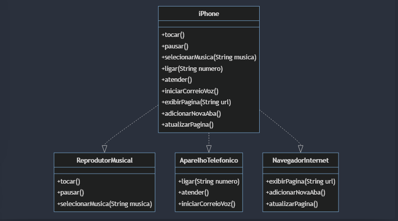

# Projeto iPhone - Modelagem POO

Este projeto tem como objetivo modelar e implementar as funcionalidades principais do iPhone, como Reprodutor Musical, Aparelho Telefônico e Navegador na Internet, utilizando conceitos de Programação Orientada a Objetos (POO).

## Diagrama UML

O diagrama UML a seguir representa a estrutura das classes e interfaces implementadas no projeto:



## Funcionalidades

### 1. Reprodutor Musical (AltoFalante)
Interface `AltoFalante`:
- **tocar()**: Inicia a reprodução de uma música.
- **pausar()**: Pausa a música em reprodução.
- **selecionarMusica(String musica)**: Seleciona uma música específica para reprodução.

### 2. Aparelho Telefônico (Telefone)
Interface `Telefone`:
- **ligar(String numero)**: Realiza uma ligação para um número especificado.
- **atender()**: Atende uma chamada.
- **iniciarCorreioVoz()**: Inicia o correio de voz.

### 3. Navegador na Internet (Navegador)
Interface `Navegador`:
- **exibirPagina(String url)**: Exibe a página da URL especificada.
- **adicionarNovaAba()**: Adiciona uma nova aba no navegador.
- **atualizarPagina()**: Atualiza a página atual.

## Implementação

A classe `Iphone` implementa as interfaces `AltoFalante`, `Telefone`, e `Navegador`, proporcionando as funcionalidades descritas acima.

```java
public class Iphone implements AltoFalante, Telefone, Navegador {
    @Override
    public void tocar() {
        System.out.println("Trim! Trim! Trim");
    }

    @Override
    public void pausar() {
        System.out.println("Pausando...");
    }

    @Override
    public void selecionarMusica(String musica) {
        System.out.println("Selecionando a música: " + musica);
    }

    @Override
    public void ligar(String numero) {
        System.out.println("Ligando para: " + numero);
    }

    @Override
    public void atender() {
        System.out.println("Atendendo a chamada...");
    }

    @Override
    public void iniciarCorreioVoz() {
        System.out.println("Iniciando correio de voz...");
    }

    @Override
    public void exibirPagina(String url) {
        System.out.println("Exibindo a página: " + url);
    }

    @Override
    public void adicionarNovaAba() {
        System.out.println("Adicionando uma nova aba...");
    }

    @Override
    public void atualizarPagina() {
        System.out.println("Atualizando a página...");
    }
}
